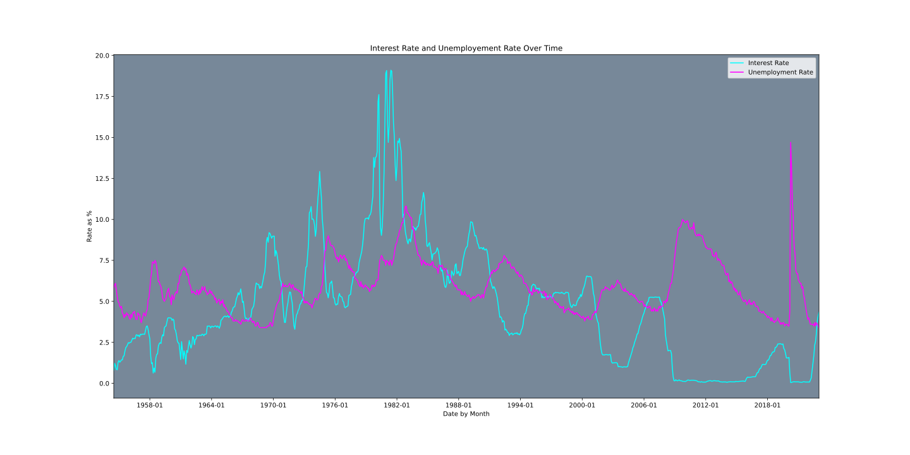
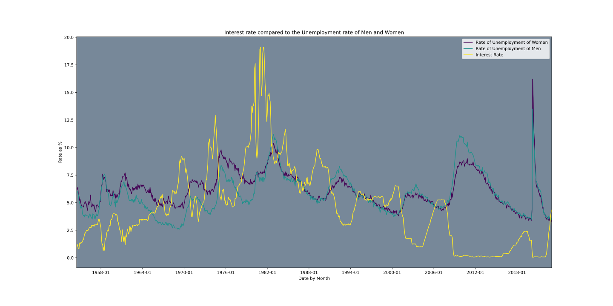

# Interest Rate vs Unemployment Rate

Over most of the period of the data, **Interest Rate** and **Unemployment Rate** had an inverse relationship based on their change. As **Unemployment rates** went up, **interest rates** went down. The absolute number of the **interest rate** wasn’t important but how it changed from month to month and year to year. The highest **unemployment rate** did coincide with a time where the **interest rate** was at or near 0, but the highest **interest rates** were not times where the **unemployment rate** was at its lowest, along with a time period in the late 70s early 80s where the **Interest Rate** was at its all time highest, but the **unemployment rate** was not any lower than the average. So these two things tend to be related, but rising **interest rates** don't necessitate low **unemployment rates**. 

# Interest Rate vs Men's Unemployment Rates vs Women's Unemployment Rates

During the early part of the data, a higher percentage of women became unemployed when **unemployment rates** were rising, but after 1980 the inverse became true. From 1980 to the current day, when **unemployment rates** get higher, a higher percentage of men are reporting themselves unemployed as compared with women. Something to keep in mind is that the **unemployment rate** only counts people who are currently looking for a job and are unemployed, so there may be other factors at play that are keeping the **unemployment rate** for women lower than for men. 

